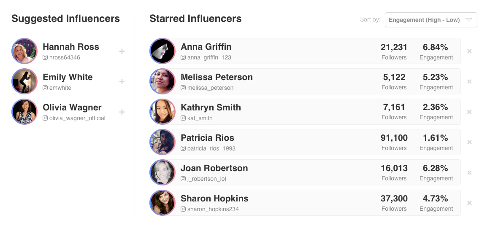

# Model Village Coding Test: Front-End Engineer

**Please upload this project to your preferred source control platform and share with Model Village. Place your work inside the `/test` folder**

We’d like to see how you approach this challenge, and what process you take, so please aim to push regular commits to the repository as you work through the task.

For this coding test, we’d like you to build out the above interface as a React application.

The app should allow a user to view their list of ‘Starred’ influencers. This list should be sortable, and it should be possible to remove a user from the list.

The app should also show a list of suggested influencers. Clicking on these users should add them to the starred influencer list.

You should:

* Use React.
* Use a state management system (we use Redux).
* Demonstrate handling data through API calls. Faking this is fine for the purposes of this demonstration.
* Allow the user to sort the list.
* Stick to the above design as much as possible.
